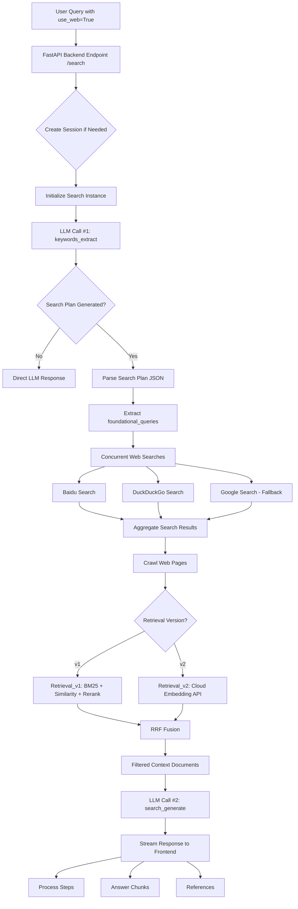

# TinyAISearch Web Search Flow Documentation

## Overview

This document provides a comprehensive breakdown of the web search process in TinyAISearch, including the complete request-response flow, LLM API calls, and data transformations.

## Table of Contents

- [High-Level Architecture](#high-level-architecture)
- [Complete Flow Diagram](#complete-flow-diagram)
- [LLM API Calls](#llm-api-calls)
- [Detailed Step-by-Step Process](#detailed-step-by-step-process)
- [Data Structures](#data-structures)
- [Performance Considerations](#performance-considerations)

## High-Level Architecture

TinyAISearch implements a RAG (Retrieval Augmented Generation) pipeline that is only activated when web search is enabled. The system has two distinct modes:

### Mode 1: Regular Chat (use_web=False)
```
User Query → LLM API → Streaming Response
```
- **LLM API Calls**: 1
- **Latency**: Low (~1-3 seconds)
- **Use Case**: General conversation, knowledge base questions

### Mode 2: Web Search Enhanced (use_web=True)
```
User Query → Search Planning (LLM #1) → Web Search → Crawling →
Retrieval (v1/v2) → Answer Generation (LLM #2) → Streaming Response
```
- **LLM API Calls**: 2 (minimum)
- **Latency**: High (~10-30 seconds)
- **Use Case**: Current events, fact-checking, comprehensive research

## Complete Flow Diagram



## LLM API Calls

### Minimum API Calls: **2**

#### LLM Call #1: Search Strategy Generation

**File**: `utils/keywords_extract.py:129-134`

**Purpose**: Analyze user query and generate a structured search plan

**API Call**:
```python
completion = client.chat.completions.create(
    model=model_name,
    messages=messages,
    temperature=0.3,
    response_format={"type": "json_object"}
)
```

**Input**:
- User query
- Chat history (up to 6 messages)
- Current date
- Complex system prompt with search strategy guidelines

**Output** (JSON):
```json
{
  "query_analysis": {
    "original_query": "OpenAI近况",
    "identified_intent": "Current_Event_Reporting",
    "assessed_complexity": "Moderate",
    "key_entities": ["OpenAI"],
    "implicit_questions": ["OpenAI最新动态是什么？", "OpenAI有什么新产品？"]
  },
  "search_plan": {
    "foundational_queries": [
      {"query": "OpenAI 2025最新消息", "engine": "baidu"},
      {"query": "OpenAI recent news 2025", "engine": "duckduckgo"}
    ]
  }
}
```

**Intent Classification**:
- `Specific_Fact_Lookup` → Simple (1-2 queries)
- `Current_Event_Reporting` → Moderate (2-3 queries)
- `How-To_Instruction` → Moderate
- `Troubleshooting_Solution` → Moderate
- `Concept_Explanation` → Complex (2-3 queries, multi-engine)
- `Comparative_Analysis` → Complex
- `Opinion_Review_Gathering` → Complex

#### LLM Call #2: Answer Generation with Context

**File**: `utils/response.py:188-193`

**Purpose**: Synthesize final answer from retrieved web content

**API Call**:
```python
response = client.chat.completions.create(
    model=model_name,
    messages=messages,
    stream=True,
    temperature=0.5
)
```

**Input**:
- User query
- Chat history
- Retrieved context documents (up to 2048 chars each)
- Implicit questions from search plan
- Current date

**System Prompt Highlights**:
- "NEVER blindly trust the search results"
- Cross-validate information from multiple sources
- Identify contradictions and conflicts
- Assess information quality
- Specify information gaps

**Output**: Streaming text response

## Detailed Step-by-Step Process

### Step 1: Frontend Request (Streamlit/Vue3)

**Frontend Files**:
- `streamlit_app.py:555-560`
- `frontend/src/views/ChatView.vue:294-299`

**Payload**:
```python
{
    "query": "user input text",
    "user_id": "user123",
    "session_id": "session_abc",
    "use_web": True  # User-controlled toggle
}
```

**HTTP Request**:
```
POST http://localhost:5000/search
Content-Type: application/json
```

### Step 2: Backend Endpoint Handler

**File**: `AISearchServer.py:275-344`

**Process**:
1. Receive request
2. Load chat history from database
3. Check `use_web` flag
4. Route to appropriate handler

```python
if not req.use_web:
    # Direct LLM call
    response_generator = generate(req.query, chat_history=processed_history)
else:
    # Web search flow (continues below)
```

### Step 3: Search Planning (LLM Call #1)

**File**: `utils/search_web.py:122-158`

**Key Code**:
```python
async def search(self, query: str, chat_history: List = [], proxy: str | None = None):
    # Step 3a: Call LLM to generate search plan
    search_plan_data = keywords_extract(query, chat_history)

    if not search_plan_data:
        return None, {"NO_SEARCH_NEEDED": []}

    # Continue to web search...
```

**Streaming Event**:
```json
{
    "type": "process",
    "payload": "🤔 正在分析问题，生成搜索策略..."
}
```

### Step 4: Web Search Execution

**File**: `utils/search_web.py:134-156`

**Concurrent Search Tasks**:
```python
foundational_queries = search_plan_data.get('search_plan', {}).get('foundational_queries', [])
tasks = []

for item in foundational_queries:
    search_query = item.get('query')
    engine = item.get('engine', 'baidu').lower()

    if engine == 'baidu':
        tasks.append(self.search_baidu(search_query))
    elif engine == 'duckduckgo':
        tasks.append(self.search_duckduckgo(search_query, proxy=proxy))

# Execute all searches concurrently
results_list = await asyncio.gather(*tasks)
```

**Search Engines**:

1. **Baidu** (`search_baidu`):
   - Best for: Chinese content, local news, weather, locations
   - Fallback: Google (if configured)

2. **DuckDuckGo** (`search_duckduckgo`):
   - Best for: Global English content
   - Features: Random delay (0.1-1.0s) to mimic human behavior
   - Timeout: 5 seconds
   - Fallback: Google (if configured)

3. **Google Custom Search API** (`google_search`):
   - Requires: `google_api_key`, `google_cse_id`
   - Only used as fallback or for complex queries
   - Configurable via `google_search_enabled` flag

**Search Result Format**:
```python
[
    {'id': 0, 'title': 'OpenAI发布新模型GPT-5', 'link': 'https://example.com/1'},
    {'id': 1, 'title': 'OpenAI Latest Updates', 'link': 'https://example.com/2'}
]
```

**Streaming Event**:
```json
{
    "type": "process",
    "payload": "🔍 搜索关键词: OpenAI 2025最新消息"
}
```

### Step 5: Web Page Crawling

**File**: `utils/crawl.py`

**Process**:
1. Extract URLs from search results
2. Fetch HTML content with timeout (10s)
3. Parse with BeautifulSoup4 and readability-lxml
4. Convert to markdown using markdownify
5. Clean and truncate content

**Crawled Page Structure**:
```python
{
    'title': 'Page Title',
    'content': 'Markdown content...',
    'url': 'https://example.com',
    'query': 'Original search query'
}
```

**Streaming Event**:
```json
{
    "type": "process",
    "payload": "✅ 搜索完成，找到 8 个相关网页"
}
```

### Step 6: Context Retrieval

Two versions available, controlled by `config.get("retrieval_version", "v2")`:

#### Option A: Retrieval v1 (Traditional RAG)

**File**: `utils/retrieval.py`

**Algorithm**:
1. **BM25 Search**: Keyword-based ranking
2. **Similarity Search**: Vector embeddings with ChromaDB
3. **Rerank**: Re-score with reranking model
4. **RRF Fusion**: Reciprocal Rank Fusion to merge results

**Key Parameters**:
```python
retrieval_quality = config.get('retrieval_quality', 'high')
# 'high': More documents, slower
# 'medium': Balanced
# 'low': Fewer documents, faster
```

**RRF Formula**:
```python
def rrf(rerank_results, text_results, k=10, m=60):
    for doc in rerank_results:
        score = 1 / (m + rank)
        # Combine scores from multiple ranking methods
```

#### Option B: Retrieval v2 (Cloud-based)

**File**: `utils/pages_retrieve.py`

**Features**:
- Cloud embedding API with batching
- Parallel processing (max 10 concurrent requests)
- Automatic text truncation (1024 chars max)
- Page-level retrieval (not chunk-level)

**Embedding API Call**:
```python
payload = {
    "model": config.get('embedding_model_name'),
    "input": texts,  # Batch of texts
    "encoding_format": "float"
}
response = requests.post(embedding_api_url, json=payload)
```

**Retrieved Context Format**:
```python
[
    {
        'title': 'OpenAI发布GPT-5',
        'content': 'OpenAI今天宣布...',
        'url': 'https://example.com/1'
    },
    # ... more documents
]
```

### Step 7: Answer Generation (LLM Call #2)

**File**: `utils/response.py:87-218`

**Process**:
```python
def search_generate(query, search_results, search_plan_data, chat_history):
    # Extract implicit questions
    implicit_questions = search_plan_data.get('query_analysis', {}).get('implicit_questions', [])

    # Format retrieved documents
    retrieval_context = [
        {
            "Title": page.get('title', ''),
            "Content": page.get('content', '')[:2048]  # Truncate to 2048 chars
        }
        for page in all_search_results
    ]

    # Build messages with context
    messages = [
        system_message,  # Contains context and instructions
        *chat_history,
        {"role": "user", "content": query}
    ]

    # Stream response
    response = client.chat.completions.create(
        model=model_name,
        messages=messages,
        stream=True,
        temperature=0.5
    )
```

**System Prompt Structure**:
```
# Role and Goal
You are a top-tier AI Search Analyst...

## Step 1: Deconstruct the User's Need
- Analyze USER_QUERY and IMPLICIT_QUESTIONS

## Step 2: Critically Evaluate the Search Results
- Cross-validate information
- Identify contradictions
- Assess information quality
- Identify information gaps

## Step 3: Synthesize a High-Value Answer
- Structure logically
- Synthesize, don't list
- Maintain objective tone

CURRENT_DATE: 2025-12-14
IMPLICIT_QUESTIONS: [...]
SEARCH_RESULTS: [...]
```

### Step 8: Streaming Response to Frontend

**File**: `AISearchServer.py:290-340`

**Stream Format** (JSON Lines):
```json
{"type": "process", "payload": "🤔 正在分析问题..."}
{"type": "process", "payload": "🔍 搜索关键词: OpenAI 2025"}
{"type": "process", "payload": "✅ 搜索完成，找到 8 个网页"}
{"type": "answer_chunk", "payload": "根据"}
{"type": "answer_chunk", "payload": "最新"}
{"type": "answer_chunk", "payload": "消息"}
...
{"type": "reference", "payload": [{"OpenAI官网": "https://openai.com"}]}
```

**Event Types**:
1. `process`: Search progress updates (显示在搜索步骤区)
2. `answer_chunk`: Streaming text tokens (拼接显示答案)
3. `reference`: Source URLs (显示在参考资料区)
4. `error`: Error messages (显示错误提示)

### Step 9: Frontend Rendering

#### Streamlit (streamlit_app.py:100-249)

```python
def process_streaming_response(response, message_placeholder, search_steps_placeholder):
    full_content = ""
    references = []
    current_steps = []

    for line in response.iter_lines():
        chunk = json.loads(line)

        if chunk['type'] == 'process':
            # Display search step with icon
            icon = determine_icon(chunk['payload'])
            current_steps.append({
                'text': chunk['payload'],
                'icon': icon,
                'timestamp': datetime.now().strftime("%H:%M")
            })

        elif chunk['type'] == 'answer_chunk':
            full_content += chunk['payload']
            message_placeholder.markdown(full_content + "▌")  # Cursor

        elif chunk['type'] == 'reference':
            references = chunk['payload']

    # Final render without cursor
    message_placeholder.markdown(full_content)
    return full_content, references
```

#### Vue3 (frontend/src/views/ChatView.vue:358-405)

```javascript
const processStreamChunk = (line) => {
    const chunk = JSON.parse(line);
    const { type, payload } = chunk;

    switch (type) {
        case 'process':
            let icon = determineIcon(payload);
            currentSearchSteps.value.push({
                text: payload,
                icon: icon,
                timestamp: new Date().toLocaleTimeString()
            });
            break;

        case 'answer_chunk':
            currentMessage.content += payload;
            scrollToBottom();
            break;

        case 'reference':
            currentMessage.references = payload;
            break;
    }
}
```

## Data Structures

### Search Plan Data

```typescript
interface SearchPlanData {
    query_analysis: {
        original_query: string;
        identified_intent:
            | "Specific_Fact_Lookup"
            | "Current_Event_Reporting"
            | "How-To_Instruction"
            | "Troubleshooting_Solution"
            | "Concept_Explanation"
            | "Comparative_Analysis"
            | "Opinion_Review_Gathering";
        assessed_complexity: "Simple" | "Moderate" | "Complex";
        key_entities: string[];
        implicit_questions: string[];
    };
    search_plan: {
        foundational_queries: Array<{
            query: string;
            engine: "baidu" | "duckduckgo" | "google";
        }>;
    };
}
```

### Search Results

```typescript
interface SearchResults {
    [searchQuery: string]: Array<{
        id: number;
        title: string;
        link: string;
    }>;
}
```

### Crawled Pages

```typescript
interface CrawledPage {
    title: string;
    content: string;  // Markdown format
    url: string;
    query: string;    // Which search query found this page
}
```

### Retrieved Context

```typescript
interface RetrievedDocument {
    title: string;
    content: string;  // Truncated to 2048 chars
    url: string;
    score?: number;   // Relevance score from retrieval
}
```

## Performance Considerations

### Timing Breakdown (Approximate)

| Stage | Time | Percentage |
|-------|------|-----------|
| Search Planning (LLM #1) | 1-3s | 10-15% |
| Web Search (Concurrent) | 2-5s | 20-25% |
| Web Crawling | 3-8s | 30-40% |
| Context Retrieval | 1-3s | 5-15% |
| Answer Generation (LLM #2) | 2-5s | 15-25% |
| **Total** | **10-30s** | **100%** |

### Optimization Strategies

1. **Concurrent Execution**:
   - All web searches run in parallel using `asyncio.gather()`
   - Embedding API calls batched (up to 10 concurrent)

2. **Caching**:
   - Search results could be cached (not implemented)
   - Embeddings could be cached (not implemented)

3. **Timeouts**:
   - Web search: 5s per engine
   - Web crawling: 10s per page
   - LLM API: 30-60s

4. **Early Termination**:
   - If search plan is empty, skip to direct LLM response
   - If all searches fail, fallback to Google or direct response

5. **Quality vs Speed Trade-off**:
   - `retrieval_quality: "low"` → Faster, fewer documents
   - `retrieval_quality: "high"` → Slower, more comprehensive

### Scalability Limits

- **Max Concurrent Searches**: 3 (one per engine)
- **Max Embedding Batch Size**: 10
- **Max Document Length**: 2048 chars per document
- **Max Chat History**: 6 messages
- **Session Storage**: SQLite (single-threaded)

### Error Handling

1. **Search Engine Failures**:
   - Baidu fails → Fallback to Google
   - DuckDuckGo fails → Fallback to Google
   - All fail → Direct LLM response

2. **Crawling Failures**:
   - Timeout → Skip page
   - Parse error → Skip page
   - Minimum 1 successful page required

3. **LLM API Failures**:
   - Retry logic (not implemented)
   - Fallback to cached response (not implemented)
   - Error message to user

4. **Frontend Abort**:
   - User clicks stop button
   - `AbortController` cancels fetch
   - Partial response displayed

## Configuration

### Required Settings

```yaml
# LLM Configuration
llm_api_key: "sk-..."
llm_base_url: "https://api.openai.com/v1"
llm_model_name: "gpt-4"

# Embedding (for Retrieval v2)
embedding_api_key: "sk-..."
embedding_base_url: "https://api.openai.com/v1"
embedding_model_name: "text-embedding-3-small"

# Rerank (for Retrieval v1)
rerank_api_key: "sk-..."
rerank_base_url: "https://api.cohere.com/v1"
rerank_model_name: "rerank-english-v3.0"

# Google Search (Optional)
google_api_key: "..."
google_cse_id: "..."
google_search_enabled: "false"

# Retrieval Settings
retrieval_version: "v2"  # "v1" or "v2"
retrieval_quality: "high"  # "low", "medium", "high"
```

### Feature Flags

- `use_web`: User-controlled toggle in frontend (default: `false`)
- `google_search_enabled`: Enable Google as fallback (default: `false`)
- `retrieval_version`: Choose retrieval algorithm (default: `"v2"`)

## Code References

### Backend Files

- `AISearchServer.py:275-344` - Main request handler
- `utils/search_web.py:122-158` - Search orchestration
- `utils/keywords_extract.py:13-156` - LLM search planning
- `utils/response.py:87-218` - LLM answer generation
- `utils/retrieval.py` - Retrieval v1 implementation
- `utils/pages_retrieve.py` - Retrieval v2 implementation
- `utils/crawl.py` - Web page crawling

### Frontend Files

- `streamlit_app.py:100-249` - Streamlit streaming handler
- `frontend/src/views/ChatView.vue:263-405` - Vue3 message sending
- `frontend/src/components/ChatMessage.vue` - Message rendering

### Configuration

- `utils/config_manager.py` - Configuration loading
- `requirements_312.txt` - Python dependencies

## Summary

The web search flow in TinyAISearch is a sophisticated RAG pipeline that:

1. **Intelligently analyzes** user queries using LLM to determine search strategy
2. **Concurrently searches** multiple engines (Baidu, DuckDuckGo, Google)
3. **Crawls and processes** web pages to extract clean content
4. **Retrieves relevant context** using either traditional (v1) or cloud-based (v2) methods
5. **Synthesizes comprehensive answers** by critically evaluating multiple sources
6. **Streams results** in real-time to provide responsive user experience

**Minimum LLM API Calls**: 2 (Search Planning + Answer Generation)

**Total Latency**: 10-30 seconds (depending on network, API speed, and complexity)

**Key Innovation**: The two-stage LLM approach ensures high-quality, contextually-aware responses by first understanding the query deeply, then synthesizing information from multiple verified sources.
